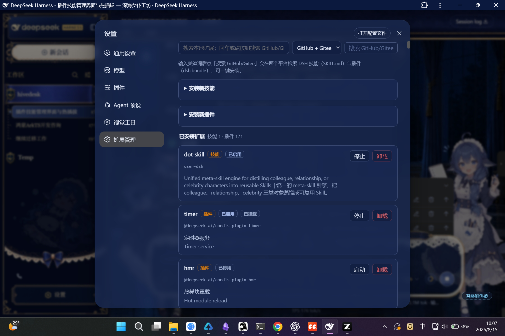
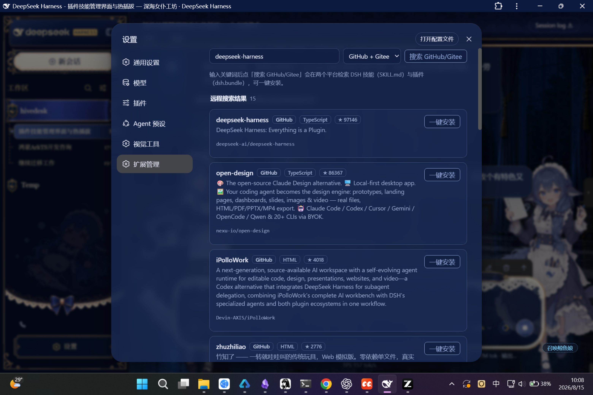

# dsh-extension-hub

> DSH Web GUI「扩展中心」——技能与插件的一体化管理插件（dual-face，无需改动 dsh 源码）

**仓库地址**：[GitHub](https://github.com/remyoli77/dsh-extension-hub) · [Gitee](https://gitee.com/remyoli/dsh-extension-hub)

`dsh-extension-hub` 是 DeepSeek Harness Web 界面的一个扩展管理插件。它把 **技能（Skills）** 与 **插件（Plugins）**
合并进同一个「扩展管理」面板，提供统一的查看、启动/停止、安装/卸载能力，并支持从 **GitHub / Gitee**
搜索并一键安装新的技能或插件。所有操作均为**热插拔**，无需重启 dsh 进程。

---

## 🖼 界面预览

**扩展管理主界面** —— 技能与插件合并列表：类型标签、启用状态、一键 启动/停止/卸载



**远程搜索安装** —— 关键词搜索 + GitHub/Gitee 平台选择 + 远程结果一键安装



---

## ✨ 功能特性

### 1. 技能与插件合并标注
- 设置面板新增 **「扩展管理」** 入口，技能与插件显示在同一个列表中。
- 每个条目都带 **类型徽标**（`技能` / `插件`）、**启用状态**、**中文功能简介**。
- 技能来源标注（`user-dsh` / `user-agents`），插件来源标注 npm 包名与挂载状态。

### 2. 一键 启动 / 停止 / 卸载（热插拔）
- 每个条目提供 **启动 / 停止** 按钮：技能通过改写 `SKILL.md` 的
  `disable-model-invocation` 开关；插件通过 Cordis Loader 运行时 API 立即生效。
- **卸载** 按钮：技能删除 `~/.dsh/skills/` 下的 bundle；插件从运行时移除（用户安装的彻底移除，
  内置插件转为停用）。
- 所有开关状态持久化到 `~/.dsh/dsh-extension-hub.json`，重启后自动恢复。

### 3. 搜索栏 + GitHub / Gitee 远程搜索
- **本地即时过滤**：输入关键词即可在已安装的技能与插件中筛选（名称/包名/简介）。
- **远程仓库搜索**：回车或点击「搜索 GitHub/Gitee」，同时在 GitHub 与 Gitee 公开 API 检索
  DSH 相关的技能仓库（含 `SKILL.md`）与插件仓库（含 `dsh.bundle` 声明）。
- 搜索结果展示：仓库名、描述、平台徽标（GitHub/Gitee）、语言、Star 数。

### 4. 一键安装（来自搜索或本地表单）
- **技能安装**：
  - 表单：填写名称（kebab-case）、功能简介、使用时机、Markdown 正文 → 落盘 `~/.dsh/skills/<name>/SKILL.md`。
  - 远程：搜索到含 `SKILL.md` 的仓库 → 自动下载并安装为技能。
- **插件安装**：
  - 表单：填写 npm 包名 + 可选条目 ID → 运行时注册到 Loader。
  - 远程：搜索到含 `dsh.bundle` 声明的仓库 → 后台执行 `dsh plugin --profile web add git+<url>`。

### 5. 全量中文简介（145 条内置词典）
- 为 dsh 内置的 **141+ 个插件** 提供中英双语的「用途一句话简介」（API 网关、会话持久化、
  工具注册表、沙箱策略……），配合 UI 全中文文案，让使用者一眼看懂每个插件是干嘛的。

### 6. 安全与保护
- **核心保护**：`modules / connection / api-gateway / webserver / ui-settings / skill-manager`
  等 GUI 生存依赖标记「核心」，禁止停用/卸载，防止误操作把界面搞挂。
- **容器保护**：根容器（`cordis:include`）与分组条目完全不出现在列表中，无法被管理。
- **回环栅栏**：所有 `/api/dsh-extension-hub/*` 路由仅接受本机回环 + 同源请求。

### 7. 依赖一致性校验（依赖体检）
- **防 Symbol/instanceof 分裂**：pnpm 依赖提升可能把 `@deepseek-ai/*` 核心包复制成
  profile 层独立副本，导致跨副本 Symbol 键/instanceof 失效（典型症状：agent 循环
  `Cannot read properties of undefined (reading 'prepare')`）。每次**安装插件后**、
  **启动时**及**手动触发**都会扫描 profile 层与权威层重复的核心包，版本一致即自动
  备份并统一为 symlink，冲突版本仅告警不处理。
- **防 peerDeps 解析失败**：安装插件时校验其 peerDependencies 能否从自身位置解析，
  提前暴露 `ERR_MODULE_NOT_FOUND`（如 `dsh-home-paths` 缺失）类问题。
- 校验记录写入 `~/.dsh/dsh-extension-hub.json` 的 `verifyLog` 字段；设置面板「扩展管理」内置
  **依赖体检**卡片（含最近一次体检记录与结果明细），点「立即体检」手动触发全量扫描并自动修复；
  也可直接调用 `POST /api/dsh-extension-hub/plugins/verify`（历史见 `GET .../plugins/verify-log`）。

---

## 📦 安装

### 方式一：链接到本地源码（开发/自用）

```bash
dsh plugin --profile web add link:C:/path/to/dsh-extension-hub
dsh web   # 重启 web 进程
```

### 方式二：npm 包（发布后）

```bash
dsh plugin --profile web add dsh-extension-hub
dsh web
```

> ⚠️ 注意：安装后**请勿再执行 `dsh plugin add/remove` 或 `pnpm install`** 去重装它，
> 那会触发 manifest reconcile 把手动接入的 bundle 条目剪掉。装好后直接 `dsh web` 重启即可。

---

## 🖥 界面说明

设置面板 → **扩展管理**：

| 区域 | 说明 |
| --- | --- |
| 搜索栏 | 本地过滤 + 远程搜索（`GitHub + Gitee` / `GitHub` / `Gitee` 三种范围） |
| 远程搜索结果 | 仓库卡片：名称、描述、平台、语言、Star，带「一键安装」按钮 |
| 安装技能 | 折叠表单：名称 / 功能简介 / 使用时机 / Markdown 正文 |
| 安装插件 | 折叠表单：npm 包名 / 条目 ID |
| 已安装扩展 | 合并列表：技能 + 插件，每条带类型徽标、状态徽标、核心标记、启动/停止/卸载 |

---

## 🏗 技术架构

```
┌──────────────────────────────┐        ┌──────────────────────────────┐
│  browser half (lib/client.js) │  HTTP  │  host half (lib/index.js)     │
│  settings.section 扩展管理     │ ─────▶ │  /api/dsh-extension-hub/*     │
│  React + ctx.slots / locale   │        │  ctx.loader 操作 / 文件系统    │
│  搜索 UI / 一键安装按钮         │ ◀───── │  GitHub/Gitee 搜索 / 探测安装  │
└──────────────────────────────┘        └──────────────────────────────┘
```

- **host half**（Node）：技能文件系统扫描/开关/安装/卸载、插件 Loader 运行时管理、
  GitHub/Gitee 仓库搜索与类型探测、进程守护控制、状态持久化、路由注册。
- **browser half**（浏览器）：设置面板「扩展管理」分区，调用 host 提供的 REST API。

### 目录结构

```
dsh-extension-hub/
├── lib/
│   ├── index.js        # host half（Node）：管理逻辑 + /api/dsh-extension-hub 路由族
│   └── client.js       # browser half：扩展管理设置分区（React）
├── tools/
│   └── dsh-watchdog.ps1  # 进程守护脚本（独立进程，挂死/崩溃自动重启 dsh web）
├── cordis.patch.yml    # 组合补丁：插入 extension-hub 行
├── package.json        # npm 包 + dsh.bundle.patch + dsh.client 声明
└── README.md
```

## 🛡 进程守护（dsh-watchdog）

**插件本体运行在 dsh web 进程内部，进程崩溃时插件无法自救**——因此守护是**独立的外部进程**，
由插件打包并提供控制界面：

- **扩展中心 → 进程守护卡片**：显示守护运行状态、累计重启次数/原因、总检查数、最近日志；
  一键 **启动 / 停止 / 刷新**。
- 守护能力：进程崩溃 / HTTP 连续无响应（挂死）/ CPU·内存异常 → 强制杀进程并**自动重启**；
  重启命令自动沿用当前 dsh 的启动方式（生产 `bin.js` / tsx 开发 `bin.ts`）。
- 统计持久化：`~/.dsh/dsh-watchdog-state.json`；日志：`~/.dsh/dsh-watchdog.log`（自动轮转）。
- 防失控：30 分钟内重启超过 5 次自动停止并弹窗告警；重启时系统弹窗 + 可选 Webhook。
- 开机自启：加入启动文件夹 `%APPDATA%\...\Startup\dsh-watchdog.cmd`（登录自动运行）。

### 关键机制

| 机制 | 说明 |
| --- | --- |
| 技能热插拔 | 改写 `SKILL.md` frontmatter；`dsh-skill-filesystem` watcher 实时感知，无需重启 |
| 插件热插拔 | `ctx.loader.update/create/remove` 运行时即时生效 |
| 持久化 | `~/.dsh/dsh-extension-hub.json`，boot 时由 host half 重放（容器/核心条目自动跳过） |
| 远程安装探测 | 优先找 `SKILL.md`（当技能）；其次找 `package.json` 的 `dsh.bundle`（当插件） |
| 类型安全 | 技能名强制 kebab-case 校验，杜绝路径穿越 |

---

## ❓ 常见问题

- **为什么看不到「扩展管理」？** 确认插件已接入 `dsh.profile.bundles` 并重启了 web 进程。
- **搜索没结果？** GitHub 未认证 API 限流约 10 次/分钟/IP，稍等重试；也可以直接输入
  仓库名关键词。
- **一键安装插件后没反应？** 插件安装走 `git + pnpm` 后台任务，耗时较长，完成后刷新页面即可。
- **某个核心插件没有按钮？** 它是 GUI 生存依赖，被保护，避免误停用。

---

## 📝 更新日志

- **0.2.14**（插件热重载自身：改代码不再需要重启 DSH）
  - 新增：**`POST /api/dsh-extension-hub/reload-self`**——用 cache-busting 的 ESM `import()`（URL 加 `?t=<now>`，Node 会重新执行模块顶层代码）重新加载本插件的 host 模块，并让 cordis loader 重建该 entry 的 fiber。改完 `lib/index.js` 后调用一次即可热生效，**无需重启 DSH 进程**（后续所有修复都通过这个端点落地）

- **0.2.13**（pnpm 安装加 --ignore-scripts）
  - 修复：**安装部分插件失败（原生依赖 postinstall 编译失败）**——`pnpm add` 会重建整个依赖树，把 profile 里已存在的原生包（cloudflared、node-pty 等）重新跑一遍 install 脚本，而 openharmony 平台无对应工具链（`Unsupported platform: openharmony`、gyp 失败）→ 整条命令 exit 1、回滚。修复：安装脚本加 **`--ignore-scripts`**（这些包此前已装好无需重建），实测跳过编译、6.6s 完成

- **0.2.12**（安装期间抑制 watchdog 自动重载）
  - 修复：**插件装到 node_modules 但 package.json 依赖丢失**——安装触发 DSH watchdog 的「profile 变化自动重载」（轮询 profile，变化后 8s 平滑重启），而 pnpm 改 profile 文件恰好触发，watchdog 重启 DSH 时 SIGTERM 中断了 pnpm 写 package.json 的收尾，导致依赖没写入、重启后插件像没装过。修复：安装 pnpm **前创建 `.dsh-ext-installing` 标记文件**，watchdog 轮询到该文件就**跳过自动重载**，pnpm 完成后删除标记——安装期间不再被打断

- **0.2.11**（插件安装 npm 优先）
  - 优化：**仓库插件安装优先走 npm registry**——探测到 `dsh.bundle` 后，先在 npm 上查该包名是否存在；若已发布，用 `pnpm add <name>@latest` 直接装（快、稳，不受慢速 GitHub codeload 大仓库下载影响，如 dsh-pet 的 103MB 仓库源码）；npm 上没发布才回退到仓库 tarball 下载

- **0.2.10**（安装下载流式化 + 进度）
  - 修复：**大仓库插件安装卡在下载阶段**——`downloadAndLocatePlugin` 用 `arrayBuffer()` 一次性读入内存（dsh-pet 仓库 103MB），且 60s 超时偏短、无进度反馈。改为**流式写入磁盘**（不占内存，进度写入任务输出）+ 超时放宽到 180s + 下载失败自动清理临时文件

- **0.2.9**（pnpm 安装绕过 safe-delete 批删护栏）
  - 修复：**插件安装到一半失败（safe-delete 批量删除需确认）**——dsh web 进程继承了 WorkBuddy/claude 的安全护栏环境变量（`CODEBUDDY_SESSION_ID`、`CLAUDE_SESSION_ID`、`CODEBUDDY_SAFE_DELETE_BULK_GUARD` 等），`pnpm add` 在 profile node_modules 删/换大量文件时触发「批量删除>50 需确认」拦截，安装中断。修复：spawn pnpm 前**剔除全部安全护栏相关环境变量**，让 rm/unlink 走零开销直通分支，安装干净完成

- **0.2.8**（插件仓库子目录探测：支持 dsh-pet 等）
  - 修复：**一键安装报「仓库根目录未找到 SKILL.md / dsh.bundle」**——dsh-market 仓库常把插件包放在**子目录**（如 `dsh-pet/dsh-pet/package.json`），旧探测只查根目录 package.json，导致误报无法识别。现有 **根目录 + 顶层子目录两段探测**，找到含 `dsh.bundle` 声明的 package.json 即安装
  - 修复：子目录插件安装链路——统一改为**下载 tarball → 解压 → 定位插件目录 → `pnpm add file:<dir>`**（无需 git，根/子目录布局皆可），实测 dsh-pet 2.4 秒装好
  - 兼容：安装后仍保留 loader entry 注册 + `installedPlugins` 持久化，重启自动恢复

- **0.2.7**（停用持久化修复：boot override 重试）
  - 修复：**「停用/卸载」的插件重启后失效**——`applyBootOverrides` 仅在启动后立即执行一次，而 bundle 条目（如设置里的「插件」分区 `ui-settings-plugins`）装配更晚，override 因 entry 尚未出现被跳过，导致重启后停用状态丢失。改为**轮询重试**（每 500ms 检查直到所有 override 目标 entry 就绪，最长约 10s），重启后停用/启用的持久化决策真正生效

- **0.2.6**（一键安装修复：免 git CLI + 注册持久化 + 按钮进度条）
  - 修复：**一键安装插件必失败**——后端用 `pnpm add git+https://…`，pnpm 解析 git 依赖需要 git CLI，但 HarmonyOS 本机无 git → 每次安装报 `git executable not found`。改为 **tarball URL 安装**（GitHub codeload / Gitee archive 的 `.tar.gz`），无需 git，实测 6-8 秒装好
  - 修复：**安装成功后重启丢失**——安装只写 node_modules 没注册 loader entry，DSH 重启重写 profile package.json 后插件像没装过。补上 `installPlugin` 注册 + `installedPlugins` 持久化，重启自动恢复
  - 新增：**一键安装按钮 → 动画进度条**（跟随任务状态：安装中滑动光条 / 失败显示原因+重试 / 成功显示「已安装」徽标）
  - 兼容：更新检测与更新任务识别 tarball URL 依赖（不再误当 npm 包走 registry）

- **0.2.5**（市场页修复 + 更新任务增强）
  - 修复：**「推荐 / 新上线 / 诊断」三个标签内容消失**——任务列表块的三元闭合括号位置错误，把三个标签 pane 一并包进了「有更新任务才显示」的条件里；任务列表为空时三个标签全部不渲染。已把任务块独立闭合，三个标签恢复为市场页常驻内容
  - 修复：**一键安装无反应**——后端安装仍用 `spawn('dsh')`（dsh web 进程 PATH 无 dsh 命令 → ENOENT 静默失败），统一改为 node 绝对路径 + pnpm（与更新引擎同款）
  - 修复：**更新失败任务悬挂无操作**——任务列表新增「重试」（插件/技能）与「清除」（全部）按钮，后端新增 `updates/tasks/remove` 接口
  - 修复：**自动检测弹「所有插件均为最新」噪音**——静默检查，仅保留更新横幅与操作类反馈
  - 新增：市场卡片「更新内容」展开区——后端 `repo-updates` 接口实时提取 GitHub/Gitee release 说明 + 近期 commit
  - 优化：**推荐标签内置精选立即显示**（离线可用），远程高星仓库异步合并；「新上线」后端双源并行（串行 30s → 最快 15s）
  - 优化：安装/更新请求统一 30s 超时，按钮带「安装中/更新中」状态，避免点了没反馈
  - 优化：更新任务进度条只在市场页显示（其余标签不再出现）

- **0.2.4**（扩展管理分组 + 精选目录 + 守护修复）
  - 插件列表按 **「我安装的扩展」/「系统自带插件」** 分组：自带插件只留启停、**不提供卸载**（防误删）；我安装的插件带绿色「我安装的」标识
  - **卸载两步确认**：首次点击变「确认卸载？」，3 秒内再点才执行，杜绝手滑
  - 搜索源新增 **「精选推荐」**：内置 9 个知名 DSH 插件目录（dsh-web-ui / dsh-TUI / modlens / vision-toolkit / genui 等），离线可浏览、一键安装走既有仓库安装通道
  - 修复：扩展中心「启动守护」按钮从未生效——node `spawn` + `detached: true` 会让 PowerShell 5.1 立即退出（exit 0、脚本不执行），已去除；重启守护实例请先停旧实例再启动（单实例守卫）
  - 守护重启命令输出重定向至 `~/.dsh/dsh-watchdog-restart.{out,err}.log`：重启失败时可见 node 真实报错（此前五次重启失败原因无迹可查）
  - 兼容：`installedPlugins` 持久化 id 支持 `include:` 前缀——patch 行挂载的插件重启后不再重复创建条目，「我安装的」标记跨重启保持

- **0.2.3**（女仆鲸鱼娘立绘）
  - 告警 toast 改用 **女仆工坊皮肤（ui-skin-maid-atelier）的鲸鱼娘立绘**（透明背景 PNG，内置 tools/assets/，自动定位，可 -ToastImage 自定义）

- **0.2.2**（鲸鱼娘告警）
  - 告警 toast 左侧加入 **鲸鱼娘 GIF 动画**（取自 dsh-pet 桌面宠物资产，自动定位，可 -ToastImage 自定义）
  - WinForms 实现，GIF 流畅动画、圆角、不抢焦点

- **0.2.1**（告警体验优化）
  - 重启告警改为静默角落通知（右下角 WPF toast，不抢焦点、自动淡出、点击即关）
  - 通知随 DSH 主题亮/暗适配（读取设置 + 系统主题回退）
  - 柔和双音提示音，替换原系统弹窗

- **0.2.0**（功能迭代：搜索增强 + 进程守护）
  - 搜索下拉框新增 **「本地已安装」** 模式：在已装技能与插件中检索（名称/包名/中英简介），结果可直接启停/卸载
  - **一键安装探测优化**：改走 contents API（任意默认分支），支持 `skills/` 技能集合目录；区分网络错误/仓库不存在/非 DSH 仓库，给出诊断性提示
  - **进程守护（dsh-watchdog）集成**：独立守护进程随包发布（`tools/`），崩溃/挂死/资源异常自动重启；扩展中心新增守护卡片（状态/统计/日志/一键启停/刷新反馈）
  - 守护增强：重启统计持久化、系统弹窗+响铃+可选 Webhook 告警、防失控（30 分钟 5 次上限）、日志轮转、单实例保护、开机自启
  - 修复：PowerShell 状态文件 BOM 兼容、无 wmic 环境进程探测、`$pid` 自动变量冲突
  - 145+ 条插件中英简介词典、全中文 UI

- **0.1.0**（首个公开版本）
  - 技能与插件合并「扩展管理」面板，一键 启动/停止/卸载
  - GitHub / Gitee 远程搜索 + 一键安装（技能直落盘 / 插件后台 git+pnpm）
  - 145 条插件中英简介词典、全中文 UI
  - 核心条目与根容器保护、回环安全栅栏

---

## 📄 开源协议

BSD-3-Clause License。详见 [LICENSE](./LICENSE)。
